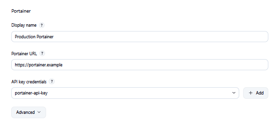
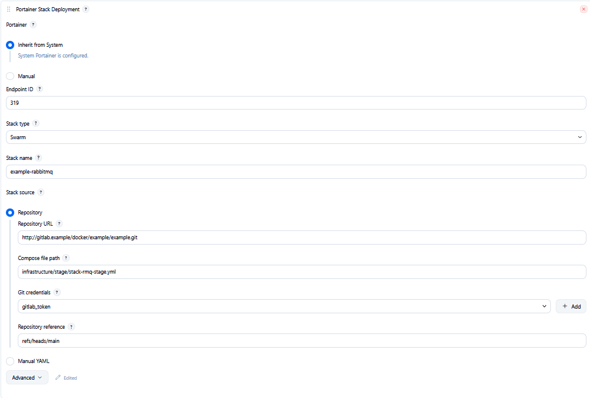
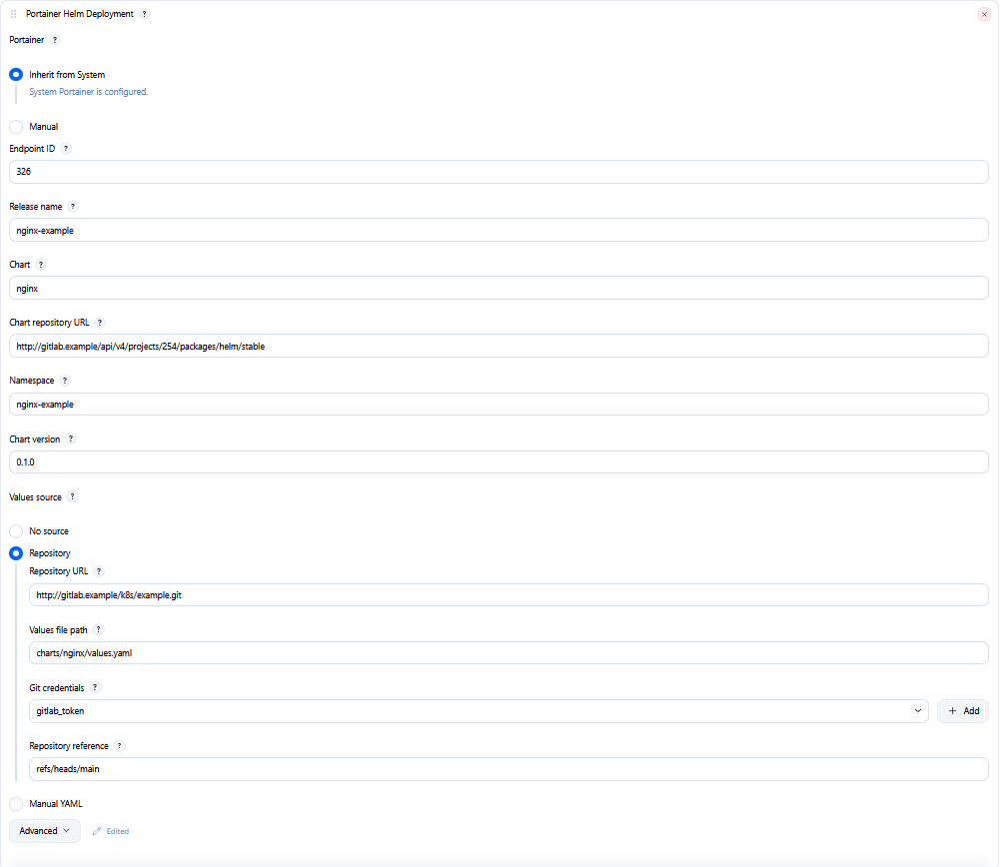
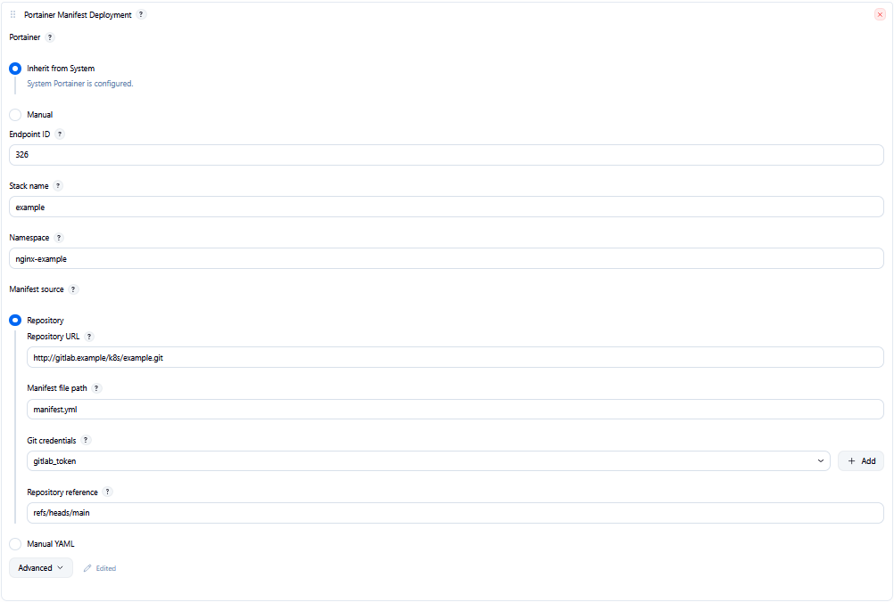
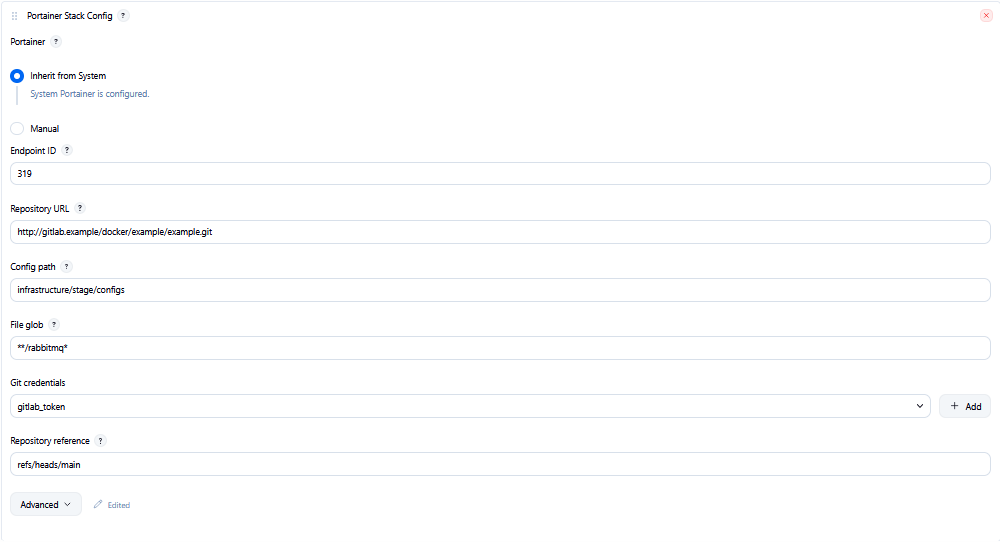
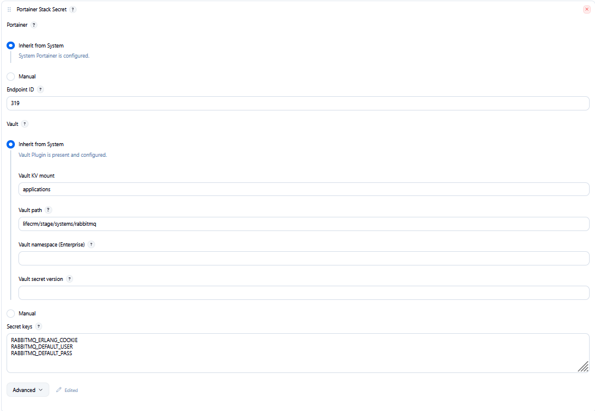

# Portainer

Deploy **Docker Compose / Swarm** stacks and **Kubernetes** workloads from Jenkins through the [Portainer](https://www.portainer.io/) API — one Access token, Freestyle or Pipeline, clear build summaries.

**Who it’s for:** platform and CI engineers who already run Portainer for day-2 ops and want Jenkins jobs to create or update stacks, Swarm configs/secrets, manifests, and Helm releases without hand-driving the Portainer UI.

Plugin id: [`portainer`](https://plugins.jenkins.io/portainer) · Artifact: `portainer` · JCasC / System symbol: `portainerApi`

## What it does

Configure Portainer once under **Manage Jenkins → System**, then add build steps that talk to the Portainer API on the controller (Jenkins proxy + credentials). Each step can **Inherit** that connection or use a **Manual** URL + API key for a specific job.

Typical flows:

- Ship a Compose or Swarm stack from Git (or paste YAML) and upsert it on an endpoint
- Ensure Swarm **configs** from Git and **secrets** from Vault before the stack redeploy
- Apply Kubernetes manifests or install/upgrade Helm charts on Kubernetes environments
- Run **Validate only** to preflight connections without mutating Portainer

Build logs stay scannable: short INFO phases and a **Summary** with `outcome=created|updated|…` (and related fields). Secrets, tokens, and YAML bodies are never dumped to the console.

## Features

- **System global config** — Portainer URL + Secret text Access token (`portainerApi`); connectivity is checked on build **preflight** (no System Test connection button)
- **Inherit / Manual** Portainer connection on every step
- **Portainer Stack Deployment** (`portainerStack`) — Compose or Swarm; Git repository or manual YAML; optional env merge / prune / repull
- **Portainer Stack Config** (`portainerStackConfig`, alias `portainerSwarmConfig`) — Swarm Docker configs from Git (content-hash names; run before Stack when using `external: true`)
- **Portainer Stack Secret** (`portainerStackSecret`, alias `portainerSwarmSecret`) — Swarm Docker secrets from Vault KV v2 (content-hash names; run before Config + Stack when needed)
- **Portainer Manifest Deployment** (`portainerManifest`) — Kubernetes manifests from Git or manual YAML
- **Portainer Helm Deployment** (`portainerHelm`) — Helm install / upgrade; values from chart defaults, Git, or inline YAML
- **Vault** — optional overlay into Stack `Env[]` (Not connected / Inherit via [HashiCorp Vault Plugin](https://plugins.jenkins.io/hashicorp-vault-plugin/) / Manual AppRole); Stack Secret reads KV for Docker secrets (not Stack Env)
- **`validateOnly`** — resolve + Portainer (and Vault when connected) preflight; log what would happen; no create/update
- **Summary logs** — `created` / `updated` (and step-specific counts) with duration-friendly summaries

## Screenshots





Optional step forms:









Screenshot checklist: [`docs/images/README.md`](docs/images/README.md). Use only `*.example` hosts; never show real API tokens.

## Quick start

1. In Portainer: **My account → Access tokens → Add access token**. Copy the token once.
2. In Jenkins: **Manage Jenkins → Credentials** → add **Secret text** (e.g. ID `portainer-api-key`) with the token.
3. **Manage Jenkins → System → Portainer**:
   - **Display name**: e.g. `Production Portainer`
   - **Portainer URL**: `https://portainer.example:9443` (API base — typically `:9000` HTTP or `:9443` HTTPS)
   - **API key credentials**: select the Secret text credential
4. Save (Save does not call Portainer; builds run preflight).
5. Add a Freestyle build step, or use Pipeline:

```groovy
pipeline {
    agent none
    stages {
        stage('Deploy stack') {
            steps {
                portainerStack(
                    endpointId: '1',
                    stackType: 'compose',
                    stackName: 'myapp',
                    repositoryUrl: 'https://gitlab.example/group/stack.git',
                    composeFilePath: 'docker-compose.yml',
                    repositoryReferenceName: 'refs/heads/main',
                    gitCredentialsId: 'git-clone',
                    env: "IMAGE_TAG=${env.BUILD_NUMBER}"
                )
            }
        }
    }
}
```

Default Portainer mode is **Inherit**. Default Vault mode on Stack is **Not connected**.

More examples:

- [`examples/PipelineSyntax.portainerStack.groovy`](examples/PipelineSyntax.portainerStack.groovy)
- [`examples/PipelineSyntax.portainerStackConfig.groovy`](examples/PipelineSyntax.portainerStackConfig.groovy)
- [`examples/PipelineSyntax.portainerStackSecret.groovy`](examples/PipelineSyntax.portainerStackSecret.groovy)
- [`examples/PipelineSyntax.portainerManifest.groovy`](examples/PipelineSyntax.portainerManifest.groovy)
- [`examples/PipelineSyntax.portainerHelm.groovy`](examples/PipelineSyntax.portainerHelm.groovy)

## Steps overview

| Step (UI) | Pipeline `@Symbol` | When to use |
|-----------|--------------------|-------------|
| **Portainer Stack Deployment** | `portainerStack` | Create/update Compose or Swarm stacks from Git or manual YAML; optional Vault → Env |
| **Portainer Stack Config** | `portainerStackConfig` (`portainerSwarmConfig`) | Ensure Swarm configs from a Git path; publish env keys for the Stack step |
| **Portainer Stack Secret** | `portainerStackSecret` (`portainerSwarmSecret`) | Ensure Swarm secrets from Vault KV v2; publish env keys for external secrets |
| **Portainer Manifest Deployment** | `portainerManifest` | Apply Kubernetes manifests (Kubernetes endpoint only) |
| **Portainer Helm Deployment** | `portainerHelm` | Install/upgrade Helm charts (Kubernetes endpoint only) |

**Suggested Swarm order:** Stack Secret (if used) → Stack Config → Stack Deployment.

## Requirements

- Jenkins **2.541.3+** 
- Portainer **2.39.3+**
- JDK truststore must trust Portainer (and Vault, if used) TLS certificates — no skip-SSL
- Optional: [HashiCorp Vault Plugin](https://plugins.jenkins.io/hashicorp-vault-plugin/) (tested with 384.vda_86ec66c537) — only for Vault **Inherit** on Stack / Secret

Most steps run on the **controller** and do not need an agent workspace. Exceptions: **Stack Config** always clones on an agent (`git` on PATH); **Helm** needs a workspace only when Values source is **Repository**.

## Install

1. **Manage Jenkins → Plugins → Available plugins** → search **Portainer** (`portainer`).
2. Or browse [plugins.jenkins.io/portainer](https://plugins.jenkins.io/portainer).
3. Advanced / air-gapped: upload the `.hpi` from a [release](https://github.com/jenkinsci/portainer-plugin/releases) if you cannot reach the Update Center.

After install, open **Manage Jenkins → System → Portainer**, then add the build steps above.

## Security

Report vulnerabilities through the [Jenkins security process](https://www.jenkins.io/security/) — see [`SECURITY.md`](SECURITY.md). Do not open public GitHub issues for security reports.

The plugin uses Jenkins credentials and the controller HTTP client with redirect following disabled; Access tokens, Vault AppRole material, and YAML/secret bodies are not echoed in logs.

## Links

- Issues: [jenkinsci/portainer-plugin](https://github.com/jenkinsci/portainer-plugin/issues)
- Security: [`SECURITY.md`](SECURITY.md) · [jenkins.io/security](https://www.jenkins.io/security/)
- Screenshots: [`docs/images/`](docs/images/)
- Pipeline examples: [`examples/`](examples/)

## License

MIT
